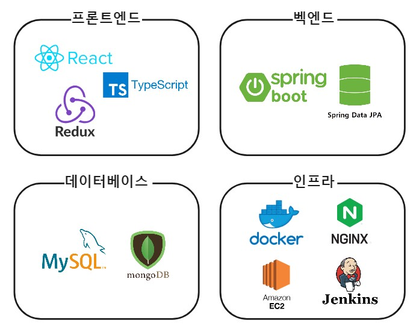

# Coffeebrew

빅데이터 추천 시스템을 이용한 커피 원두 추천 사이트

## 🪔프로젝트 소개

### 📅진행 일정

23.04.10(월) ~ 23.05.19(금) (총 6주)

- 학습 및 기획, 설계 : 04.10 ~ 05.05 (4주)
  - 학습 : 1차 교보재 강의 학습
  - 기획 : 프로젝트 아이디어 논의, 주제 구체화, 기술 스택 선정
  - 설계 : 기능 요구 명세서 작성, ERD, 와이어프레임, 프로젝트 구조 설계, REST API 설계
- 개발 : 05.08 ~ 05.19 (2주)
  - API 구현
  - 프로젝트 주요 기능 구현
  - 배포 및 인프라 구축

## 🤝팀 소개

| 이름                                                       | 개발 내용                                             |
| ---------------------------------------------------------- | ----------------------------------------------------- |
| [👨🏻‍💻 김주성](https://github.com/{}) [📧](mailto:@gmail.com) | 팀장, React 정보 페이지, 푸터&네비바, 기본 틀 및 API, redux상태관리   |
| [👨🏻‍💻 권동규](https://github.com/{}) [📧](mailto:@gmail.com) | 부팀장, React  원두 조회 페이지 및 프로필 디자인 및 키워드 검색 기능 구현,                                                |
| [👨🏻‍💻 김성태](https://github.com/{}) [📧](mailto:@gmail.com) | React  아이디어 기획, 메인페이지, 소개페이지 디자인 및 구현                                                 |
| [👨🏻‍💻 유헌상](https://github.com/{}) [📧](mailto:@gmail.com) | 팀장   Spring Boot REST API  Fast API, 추천알고리즘 설계                                |
| [👨🏻‍💻 이동훈](https://github.com/{}) [📧](mailto:@gmail.com) | Spring Boot REST API  젠킨스와 도커를 활용한 CI/CD   송신함 API, 수신함 API, Template API, Docsfile API, Templatefile API
| [👨🏻‍💻 한재욱](https://github.com/{}) [📧](mailto:@gmail.com) | Spring Boot REST API  젠킨스와 도커를 활용한 CI/CD   Social login, 리뷰 관련 API, 마이페이지 관련API|

### 🏁목표

조금 더 편하게 !!!

### 🤔기획 의도

문서 취합을 더 편하게 !!!

#### 🎯서비스 대상

발신자: 문서 전파자 및 그룹 관리자
수신자: 요반환자

#### 🎨UI/UX

직관적인 문서 관리 플랫폼

#### ⚙Technical

##### 📡프론트엔드

React, Redux, Typescript, TailWind, twin-macro

##### 📡벡엔드

Spring Rest API

##### 📡데이터베이스

MySQL, MongoDB

## 🛠기술 스택

- 세부내역
  > | 구분     | 기술스택          | 상세내용           | 버전    |
  > | :------- | :---------------- | :----------------- | :------ |
  > | 공통     | 형상관리          | GitLab             | -       |
  > | &nbsp;   | 이슈관리          | Jira               | -       |
  > | &nbsp;   | 커뮤니케이션      | Mattermost         | -       |
  > | FrontEnd | HTML5             |
  > | &nbsp;   | CSS3              |
  > | &nbsp;   | JavaScript(ES6)   |
  > | &nbsp;   | styled-components | Tailwind           | 2.2.0   |
  > | &nbsp;   | React             | React              | 18.2.0  |
  > | &nbsp;   | &nbsp;            | Redux              | 8.0.5   |
  > | &nbsp;   | &nbsp;            | Redux-Toolkit      | 1.9.2   |
  > | &nbsp;   | IDE               | Visual Studio Code | 1.75.1  |
  > | BackEnd  | Java              | OpenJDK            | 11.0.15 |
  > | &nbsp;   | Build             | Gradle             | 7.6.1   |
  > | &nbsp;   | Spring            | Boot               | 2.7.9   |
  > | &nbsp;   | &nbsp;            | Security           | 5.6.1   |
  > | &nbsp;   | DB                | Mysql              | 8.0.32  |
  > | &nbsp;   | &nbsp;            | Spring-Data-jpa    | 2.6.0  |
  > | &nbsp;   | IDE               | IntelliJ           | 22.3.1  |
  > | Server   | AWS EC2           | Ubuntu             | 20.04   |
  > | &nbsp;   | 배포              | Docker             | 23.0.0  |
  > | &nbsp;   | 배포              | Docker-compose     | 23.0.0  |
  > | &nbsp;   | &nbsp;            | Jenkins            | 2.375.2 |
  > | &nbsp;   | WebServer         | Nginx              | 1.23.3  |

### 📬배포 방법

> - [[링크 참조](/exec/1_2_TechStack.md)]
 
## 💼기획/설계

### 📑기능 요구 명세서

 
### 📑ERD

 

## 🛰프로젝트 관리/운영

 

## 📱서비스 구현 내용

### 🕹주요 기능

#### 메인페이지 - 커피추천

 

 

#### 커피이야기

 

 

 

#### 구경하기

 

 

#### 원두 성향테스트

 

#### 마이페이지

 

 

 
